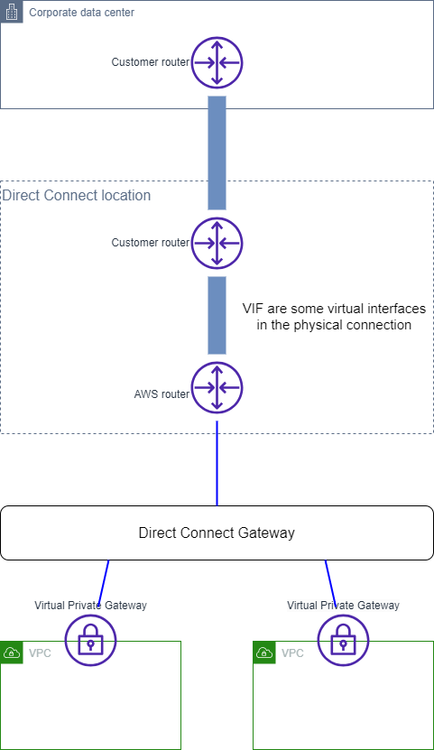

# Direct-Connectリソースの関連は

Private VIF と Direct Connect Gateway を利用するパターン。

AWS クラウドへの物理的な接続を提供する拠点のことを「Direct Connect ロケーション」と呼ぶ。

オンプレミスから Direct Connect ロケーションまでを専用線で接続する。この物理接続のことを「接続」と呼ぶ。

物理接続の中に、複数の論理インターフェースを保持できる。これを VIF と呼ぶ。
