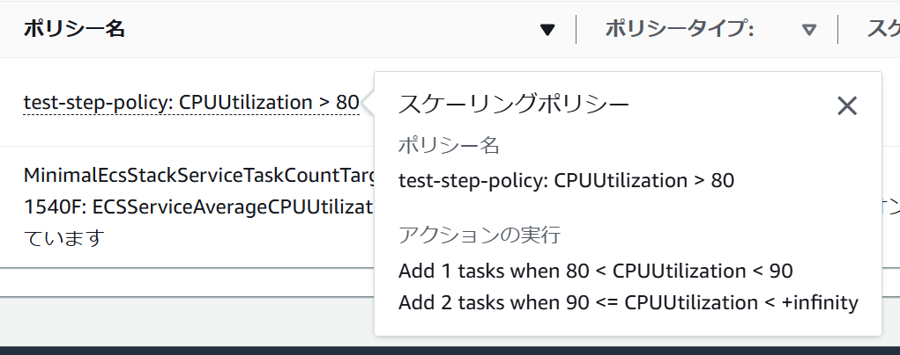
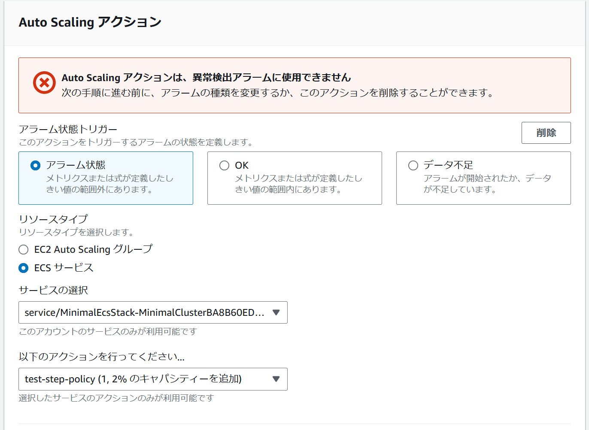

# ステップスケーリングの属性を取得するには



```bash
aws application-autoscaling describe-scaling-policies --service-namespace ecs
# {
#     "ScalingPolicies": [
#         {
#             ...
#             "ScalableDimension": "ecs:service:DesiredCount",
#             "PolicyType": "StepScaling",
#             "StepScalingPolicyConfiguration": {
#                 "AdjustmentType": "ChangeInCapacity",
#                 "StepAdjustments": [
#                     {
#                         "MetricIntervalLowerBound": 0.0,
#                         "MetricIntervalUpperBound": 10.0,
#                         "ScalingAdjustment": 1
#                     },
#                     {
#                         "MetricIntervalLowerBound": 10.0,
#                         "ScalingAdjustment": 2
#                     }
#                 ],
#                 "MetricAggregationType": "Average"
#             },
#             "Alarms": [
#                 {
#                     "AlarmName": "TargetTracking-service/MinimalEcsStack-MinimalClusterBA8B60ED-L7aE374vHPtl/MinimalEcsStack-ServiceD69D759B-l93YxuMlHQJS-AlarmHigh-946915b2-9722-4c48-8dd4-d0dad01c1628",
#                     "AlarmARN": "arn:aws:cloudwatch:ap-northeast-1:<account-id>:alarm:TargetTracking-service/MinimalEcsStack-MinimalClusterBA8B60ED-L7aE374vHPtl/MinimalEcsStack-ServiceD69D759B-l93YxuMlHQJS-AlarmHigh-946915b2-9722-4c48-8dd4-d0dad01c1628"
#                 }
#             ],
#             ...
#         },
```

しきい値の `80` はスケーリングポリシーでは保持されていないため、アラームの `Threshold` から取得する必要がある。

`90` は `MetricIntervalUpperBound`、`MetricIntervalLowerBound`およびしきい値から算出する。

```bash
aws cloudwatch describe-alarms --alarm-names TargetTracking-service/MinimalEcsStack-MinimalClusterBA8B60ED-L7aE374vHPtl/MinimalEcsStack-ServiceD69D759B-l93YxuMlHQJS-AlarmHigh-946915b2-9722-4c48-8dd4-d0dad01c1628
# {
#     "MetricAlarms": [
#         {
#             "AlarmName": "TargetTracking-service/MinimalEcsStack-MinimalClusterBA8B60ED-L7aE374vHPtl/MinimalEcsStack-ServiceD69D759B-l93YxuMlHQJS-AlarmHigh-946915b2-9722-4c48-8dd4-d0dad01c1628",
#             "AlarmArn": "arn:aws:cloudwatch:ap-northeast-1:<account-id>:alarm:TargetTracking-service/MinimalEcsStack-MinimalClusterBA8B60ED-L7aE374vHPtl/MinimalEcsStack-ServiceD69D759B-l93YxuMlHQJS-AlarmHigh-946915b2-9722-4c48-8dd4-d0dad01c1628",
#             "AlarmDescription": "DO NOT EDIT OR DELETE. For TargetTrackingScaling policy arn:aws:autoscaling:ap-northeast-1:<account-id>:scalingPolicy:1ff9f4a5-2cdf-4f5a-a0af-b61ee54dfee3:resource/ecs/service/MinimalEcsStack-MinimalClusterBA8B60ED-L7aE374vHPtl/MinimalEcsStack-ServiceD69D759B-l93YxuMlHQJS:policyName/MinimalEcsStackServiceTaskCountTargetCpuScalingF421540F:createdBy/46d76c1f-f5aa-4a9d-b5f2-5f9da5f3b082.",
#             "AlarmConfigurationUpdatedTimestamp": "2024-07-18T01:05:48.566000+00:00",
#             "ActionsEnabled": true,
#             "OKActions": [],
#             "AlarmActions": [
#                 "arn:aws:autoscaling:ap-northeast-1:<account-id>:scalingPolicy:1ff9f4a5-2cdf-4f5a-a0af-b61ee54dfee3:resource/ecs/service/MinimalEcsStack-MinimalClusterBA8B60ED-L7aE374vHPtl/MinimalEcsStack-ServiceD69D759B-l93YxuMlHQJS:policyName/test-step-policy",
#                 "arn:aws:autoscaling:ap-northeast-1:<account-id>:scalingPolicy:1ff9f4a5-2cdf-4f5a-a0af-b61ee54dfee3:resource/ecs/service/MinimalEcsStack-MinimalClusterBA8B60ED-L7aE374vHPtl/MinimalEcsStack-ServiceD69D759B-l93YxuMlHQJS:policyName/MinimalEcsStackServiceTaskCountTargetCpuScalingF421540F:createdBy/46d76c1f-f5aa-4a9d-b5f2-5f9da5f3b082"
#             ],
#             "InsufficientDataActions": [],
#             "StateValue": "OK",
#             "StateReason": "Threshold Crossed: 3 datapoints [0.5573157072067261 (17/07/24 21:15:00), 0.5481177369753519 (17/07/24 21:14:00), 2.1135900020599365 (17/07/24 21:13:00)] were not greater than the threshold (80.0).",
#             "StateReasonData": "{\"version\":\"1.0\",\"queryDate\":\"2024-07-17T21:16:46.747+0000\",\"startDate\":\"2024-07-17T21:13:00.000+0000\",\"unit\":\"Percent\",\"statistic\":\"Average\",\"period\":60,\"recentDatapoints\":[2.1135900020599365,0.5481177369753519,0.5573157072067261],\"threshold\":80.0,\"evaluatedDatapoints\":[{\"timestamp\":\"2024-07-17T21:15:00.000+0000\",\"sampleCount\":1.0,\"value\":0.5573157072067261}]}",
#             "StateUpdatedTimestamp": "2024-07-17T21:16:46.747000+00:00",
#             "MetricName": "CPUUtilization",
#             "Namespace": "AWS/ECS",
#             "Statistic": "Average",
#             "Dimensions": [
#                 {
#                     "Name": "ClusterName",
#                     "Value": "MinimalEcsStack-MinimalClusterBA8B60ED-L7aE374vHPtl"
#                 },
#                 {
#                     "Name": "ServiceName",
#                     "Value": "MinimalEcsStack-ServiceD69D759B-l93YxuMlHQJS"
#                 }
#             ],
#             "Period": 60,
#             "Unit": "Percent",
#             "EvaluationPeriods": 3,
#             "Threshold": 80.0,
#             "ComparisonOperator": "GreaterThanThreshold",
#             "StateTransitionedTimestamp": "2024-07-17T21:16:46.747000+00:00"
#         }
#     ],
#     "CompositeAlarms": []
# }
```

なお、異常検出アラームはAuto Scalingアクションには使用できないため、考慮する必要はない。


