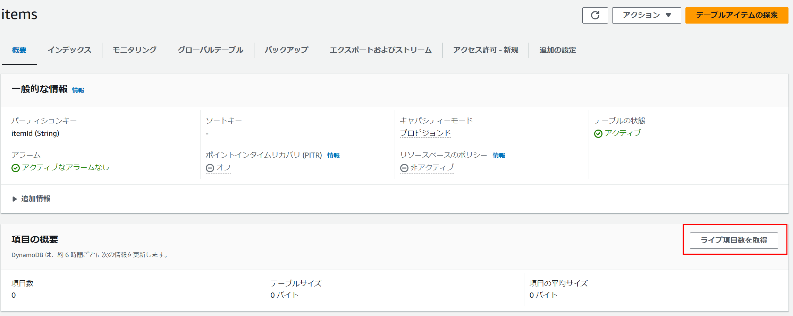
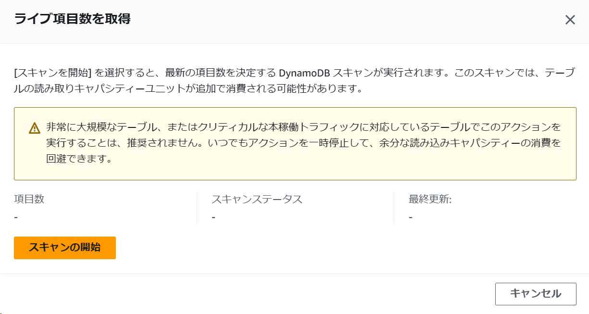
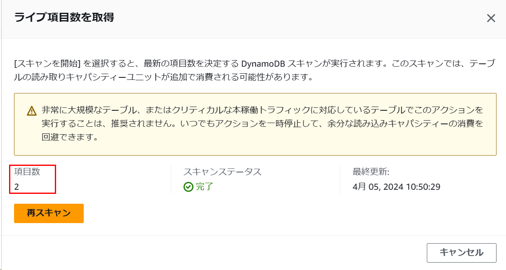
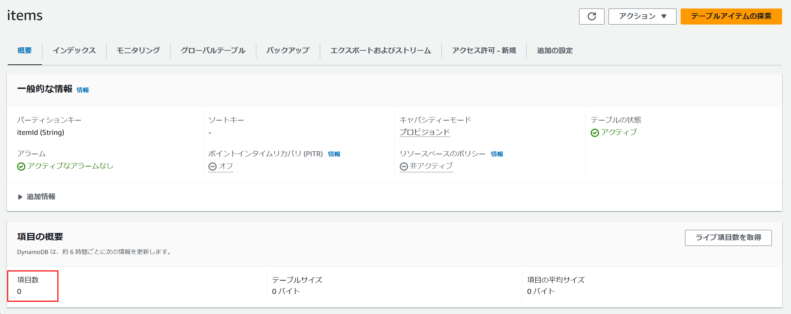

# 最新のItemCountを取得するには

## APIを利用する

API で取得するには、scan の Select パラメータで COUNT を指定する。

https://stackoverflow.com/questions/73946127/how-to-get-live-count-immediately-after-insertion-from-dynamodb-using-boto3

```python
>>> r = c.scan(TableName="items")
>>> pprint.pp(r)
{'Items': [{'itemId': {'S': '2'}}, {'itemId': {'S': '1'}}],
 'Count': 2,
 'ScannedCount': 2,
 ...
```

Count は ScanFilter が適用された値。ScannedCount は ScanFilter を適用する前の値。ScanFilter を指定しない場合は、値が一致する。

## テーブルのItemCount属性への反映

なお、describe_table レスポンスの ItemCount に反映されるには 6 時間かかる。scan しても即時に反映されるわけではない。

```python
>>> import boto3
>>> s = boto3.Session()
>>> c = s.client('dynamodb')
>>> r = c.describe_table(TableName="items")
>>> print(r["Table"]["ItemCount"])
0
```

https://docs.aws.amazon.com/ja_jp/amazondynamodb/latest/APIReference/API_TableDescription.html#DDB-Type-TableDescription-ItemCount

> ItemCount
>
> The number of items in the specified table. DynamoDB updates this value approximately every six hours. Recent changes might not be reflected in this value.

「指定したテーブル内の項目の数。DynamoDB は、この値をおおよそ 6 時間ごとに更新します。最近の変更は、この値に反映されない可能性があります」

## キャパシティーユニットの消費

https://boto3.amazonaws.com/v1/documentation/api/latest/reference/services/dynamodb/client/scan.html

> Note that this uses the same quantity of read capacity units as getting the items, and is subject to the same item size calculations.

「これは、アイテムの取得と同じ量の読み取りキャパシティーユニットを使用し、同じアイテムサイズの計算の対象となることに注意してください」

## マネージメントコンソールを利用する

マネージメントコンソールでは「ライブ項目数を取得」で同じことができる。



スキャンを開始する。



最新の項目数を取得できた。



scan API と同様、項目数には反映されない


