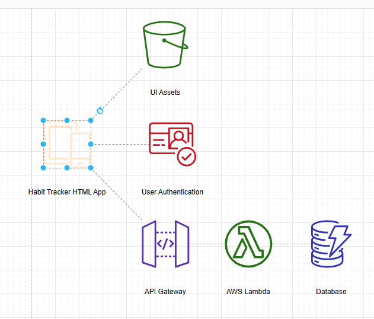

# CSVからAWS構成図を生成するには

draw.io で、CSV から AWS の構成図を生成してみた。画像ではなく、オブジェクトとして生成されるので、編集もできる。



具体的には、メニュー `配置 -> 挿入 -> 高度な設定 -> CSV...` で表示されるダイアログに、所定のフォーマットの CSV をペーストし、インポートする。

利用した CSV サンプルは、公式リポジトリにある。

https://github.com/jgraph/drawio-diagrams/blob/dev/examples/csv/habit-tracker-app-aws.txt

```Text
## Habit Tracker app AWS diagram
# label: %component%
# style: shape=%shape%;fillColor=%fill%;strokeColor=%stroke%;verticalLabelPosition=bottom;
# namespace: csvimport-
# connect: {"from":"refs", "to":"id", "invert":true, "style":"curved=0;endArrow=none;endFill=0;dashed=1;strokeColor=#6c8ebf;"}
# width: 80
# height: 80
# ignore: id,shape,fill,stroke,refs
# nodespacing: 40
# levelspacing: 40
# edgespacing: 40
# layout: horizontaltree
## CSV data starts below this line
id,component,fill,stroke,shape,refs
1,Habit Tracker HTML App,#ffe6cc,#d79b00,mxgraph.aws4.mobile,
2,UI Assets,#277116,#ffffff,mxgraph.aws4.s3,1
3,User Authentication,#C7131F,#ffffff,mxgraph.aws4.cognito,1
4,API Gateway,#5A30B5,#ffffff,mxgraph.aws4.api_gateway,1
5,AWS Lambda,#277116,none,mxgraph.aws4.lambda_function,4
6,Database,#3334B9,#ffffff,mxgraph.aws4.dynamodb,5
```

ALB -> EC2 の例。

```Text
## Simple web server AWS diagram
# label: %component%
# style: shape=%shape%;fillColor=%fill%;strokeColor=%stroke%;verticalLabelPosition=bottom;
# namespace: csvimport-
# connect: {"from":"refs", "to":"id", "invert":true, "style":"curved=0;endArrow=none;endFill=0;dashed=1;strokeColor=#6c8ebf;"}
# width: 80
# height: 80
# ignore: id,shape,fill,stroke,refs
# nodespacing: 40
# levelspacing: 40
# edgespacing: 40
# layout: horizontaltree
## CSV data starts below this line
id,component,fill,stroke,shape,refs
1,ALB,#8C4FFF,#ffffff,mxgraph.aws4.application_load_balancer,
2,EC2,#ED7100,#ffffff,mxgraph.aws4.ec2,1
```
