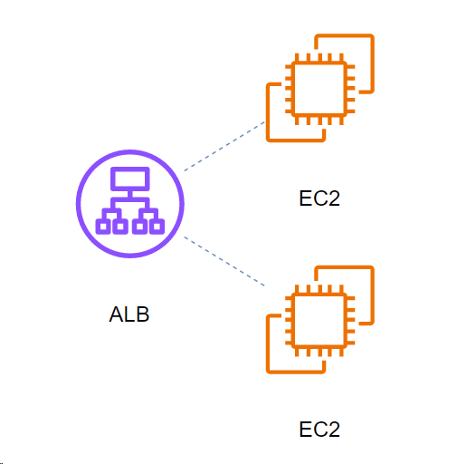
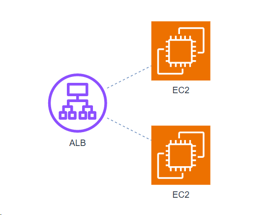

# CSVでstyleを使い分けるには

変更前の CSV。`style` で、唯一のスタイルを定義している。

```Text
## Simple web server AWS diagram
# label: %component%
# style: shape=%shape%;fillColor=%fill%;strokeColor=%stroke%;verticalLabelPosition=bottom;
# namespace: csvimport-
# connect: {"from":"refs", "to":"id", "invert":true, "style":"curved=0;endArrow=none;endFill=0;dashed=1;strokeColor=#6c8ebf;"}
# width: 80
# height: 80
# ignore: id,refs,shapeType
# nodespacing: 40
# levelspacing: 40
# edgespacing: 40
# layout: horizontaltree
## CSV data starts below this line
id,component,fill,stroke,shape,refs
1,ALB,#8C4FFF,#ffffff,mxgraph.aws4.application_load_balancer,
2,EC2,#ED7100,#ffffff,mxgraph.aws4.ec2,1
3,EC2,#ED7100,#ffffff,mxgraph.aws4.ec2,1
```




複数の style を併用するには、`stylename` と `styles` を利用する。

https://github.com/jgraph/drawio-diagrams/blob/dev/examples/csv/car-partial-supply-chain.txt

<!--
## Supply chain tracking example
# label: %name%
# stylename: shapeType
# styles: {"raw": "shape=parallelogram;fillColor=#f5f5f5;strokeColor=#666666;perimeter=parallelogramPerimeter;", \
...
#          "component":"shape=ellipse;fillColor=#ffffff;strokeColor=#000000;perimeter=ellipsePerimeter;"}
# namespace: csvimport-
# connect: {"from":"supplier", "to":"id", "invert":true, "style":"curved=1;endArrow=blockThin;startArrow=none;strokeColor=#999999;endFill=1;"}
# width: auto
# height: auto
# padding: 40
# ignore: id,shapeType,supplier
# nodespacing: 40
# levelspacing: 40
# edgespacing: 40
# layout: horizontalflow
## CSV data starts below this line
id,name,supplier,shapeType
mb,Mine B,,raw
...
1,gearbox housing,fb,component
...
-->

```Text
## Simple web server AWS diagram
# label: %component%
# stylename: shapeType
# styles: {"alb": "sketch=0;outlineConnect=0;fontColor=#232F3E;gradientColor=none;fillColor=#8C4FFF;strokeColor=none;dashed=0;verticalLabelPosition=bottom;verticalAlign=top;align=center;html=1;fontSize=12;fontStyle=0;aspect=fixed;pointerEvents=1;shape=mxgraph.aws4.application_load_balancer;sketch=0;outlineConnect=0;fontColor=#232F3E;gradientColor=none;fillColor=#8C4FFF;strokeColor=none;dashed=0;verticalLabelPosition=bottom;verticalAlign=top;align=center;html=1;fontSize=12;fontStyle=0;aspect=fixed;pointerEvents=1;shape=mxgraph.aws4.application_load_balancer;", \
# "ec2": "sketch=0;points=[[0,0,0],[0.25,0,0],[0.5,0,0],[0.75,0,0],[1,0,0],[0,1,0],[0.25,1,0],[0.5,1,0],[0.75,1,0],[1,1,0],[0,0.25,0],[0,0.5,0],[0,0.75,0],[1,0.25,0],[1,0.5,0],[1,0.75,0]];outlineConnect=0;fontColor=#232F3E;fillColor=#ED7100;strokeColor=#ffffff;dashed=0;verticalLabelPosition=bottom;verticalAlign=top;align=center;html=1;fontSize=12;fontStyle=0;aspect=fixed;shape=mxgraph.aws4.resourceIcon;resIcon=mxgraph.aws4.ec2;"}
# namespace: csvimport-
# connect: {"from":"refs", "to":"id", "invert":true, "style":"curved=0;endArrow=none;endFill=0;dashed=1;strokeColor=#6c8ebf;"}
# width: 80
# height: 80
# ignore: id,refs,shapeType
# nodespacing: 40
# levelspacing: 40
# edgespacing: 40
# layout: horizontaltree
## CSV data starts below this line
id,component,refs,shapeType
1,ALB,,alb
2,EC2,1,ec2
3,EC2,1,ec2
```

