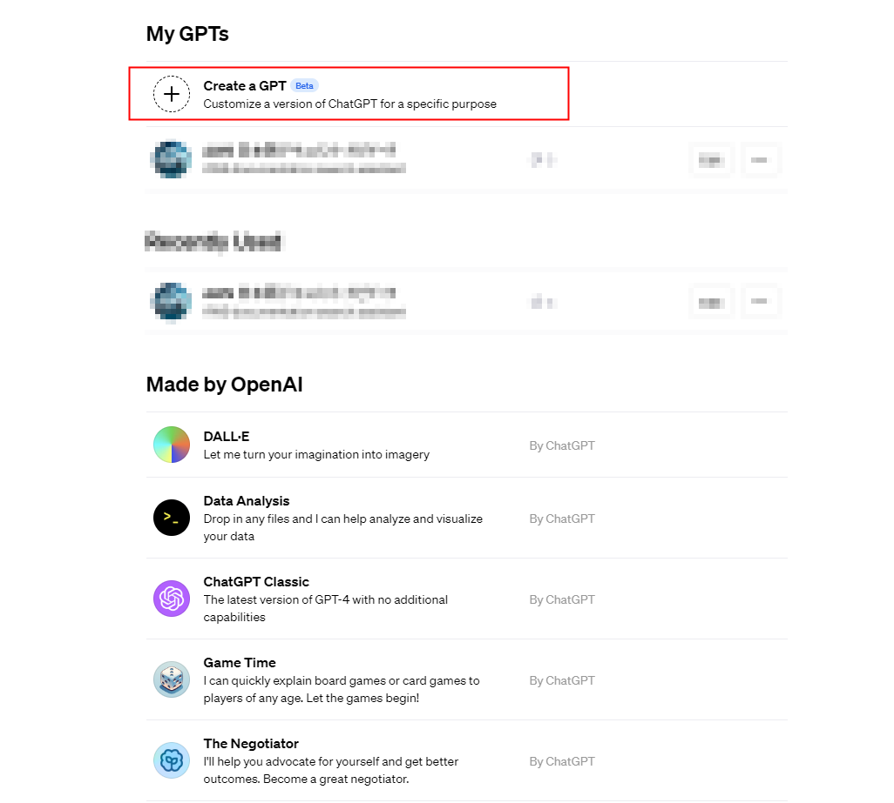
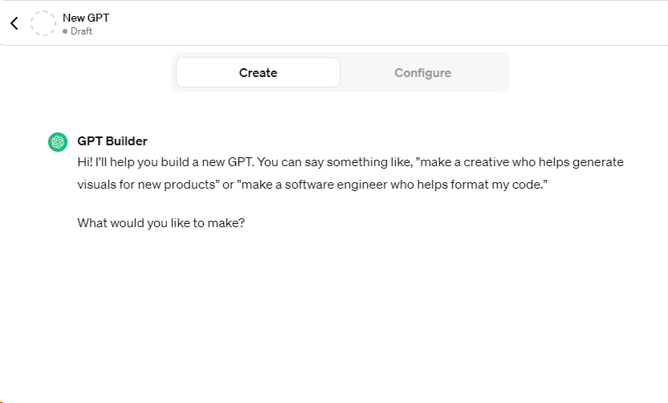
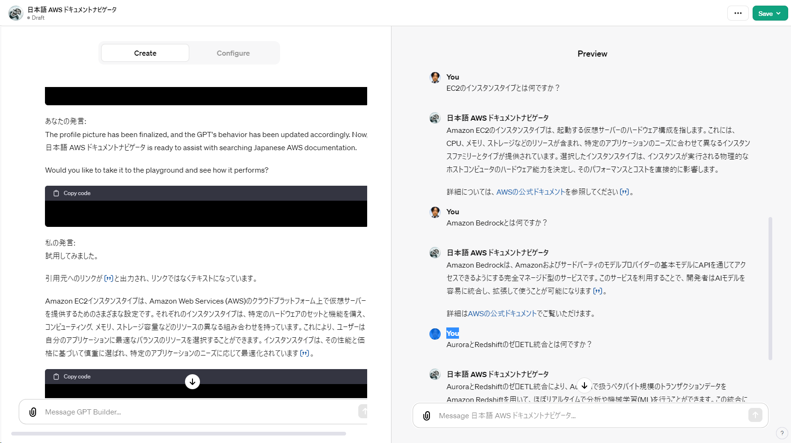
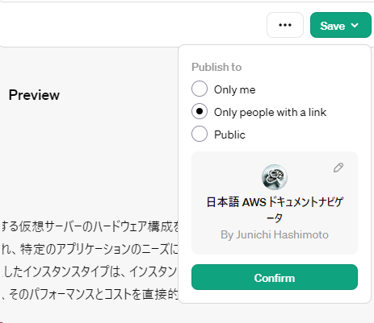
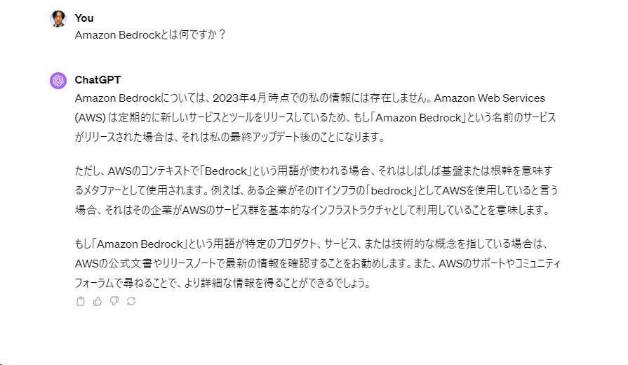
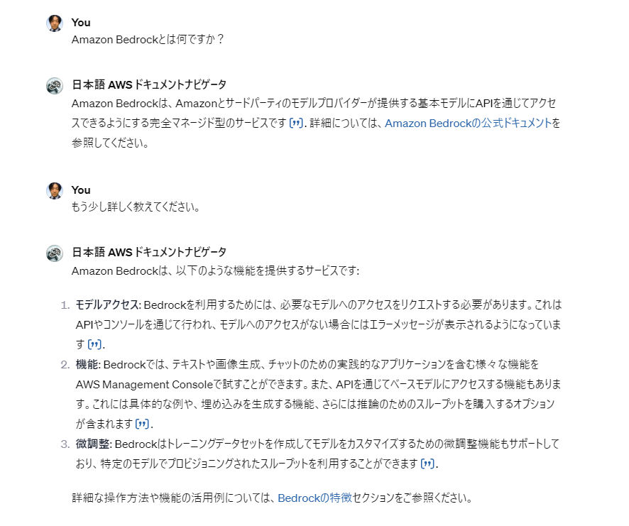

# GPTsでChatGPTをカスタマイズするには

GPTs で AWS ドキュメントを検索する ChatGPT を作成してみました。

`My GPTs`から`Create a GPT`を選択。



プロンプトを入力し、GPT Builder との対話形式で進めていきます。




```plaintext:GPT Builder
Hi! I'll help you build a new GPT. You can say something like, "make a creative who helps generate visuals for new products" or "make a software engineer who helps format my code."

What would you like to make?
```

```plaintext:You
AWS公式ドキュメントの検索エンジンを作成してください。検索対象は、日本語ドキュメントに限定してください。
URL: https://docs.aws.amazon.com/ja_jp/
```

ネーミングやロゴも提案してくれます。

```plaintext:GPT Builder
Great, we're making a GPT that will help users navigate and search the AWS official documentation in Japanese.

How about we call it AWS Doc Navigator? Do you like this name, or would you prefer a different one?
```

```plaintext:You
検索対象が日本語ドキュメントであることを明示したいので、ネーミングは日本語でお願いします。
```

```plaintext:GPT Builder
Here is the initial profile picture for 日本語 AWS ドキュメントナビゲータ. It features elements that represent navigation and documentation with a focus on the Japanese language for AWS documentation.

Do you like this profile picture, or would you like to make any changes?
```

```plaintext:You
ネーミングは、それでお願いします。Profile Pictureに`AWS`の文字を入れられますか？
```

```plaintext:GPT Builder
The profile picture has been finalized, and the GPT's behavior has been updated accordingly. Now, 日本語 AWS ドキュメントナビゲータ is ready to assist with searching Japanese AWS documentation.

Would you like to take it to the playground and see how it performs?
```

準備が整うと、試用を勧められました。右側の Preview ペインで試してみます。期待した回答に近い結果は得られているようです。



保存します。今回は試用なので `Public`` は避けました。



では、利用してみます。

通常の ChatGPT (GPT-4) と比べてみます。

Amazon Bedrock のような登場したばかりのサービスだと、ChatGPT は回答できません。



今回カスタマイズした ChatGPT だと、回答してくれます。



## 対話ログ

対話のログを残しておきます。

先に記載したプロンプトは、ログから抜粋したもので、期待した結果が得られるまで、かなり試行錯誤しました。

<details><summary>対話ログ</summary>

```plaintext
GPT Builder
Hi! I'll help you build a new GPT. You can say something like, "make a creative who helps generate visuals for new products" or "make a software engineer who helps format my code."

What would you like to make?

User
You
AWS公式ドキュメントの検索エンジンを作成してください。検索対象は、日本語ドキュメントに限定してください。
URL: https://docs.aws.amazon.com/ja_jp/
ChatGPT
GPT Builder
Great, we're making a GPT that will help users navigate and search the AWS official documentation in Japanese.

How about we call it AWS Doc Navigator? Do you like this name, or would you prefer a different one?

User
You
検索対象が日本語ドキュメントであることを明示したいので、ネーミングは日本語でお願いします。
ChatGPT
GPT Builder
Profile Picture
Here is the initial profile picture for 日本語 AWS ドキュメントナビゲータ. It features elements that represent navigation and documentation with a focus on the Japanese language for AWS documentation.

Do you like this profile picture, or would you like to make any changes?

User
You
ネーミングは、それでお願いします。Profile Pictureに`AWS`の文字を入れられますか？
ChatGPT
GPT Builder
Profile Picture
The profile picture has been updated to include the 'AWS' letters. How do you feel about this one?

User
You
画像はコンセプトにマッチしていますが、`AWS`の文字が認識できないです。修正してもらえますか？
ChatGPT
GPT Builder
Profile Picture
I've updated the image to make the 'AWS' text more recognizable while maintaining the concept. Does this meet your expectations?

User
You
やっぱり文字が認識できないですね。`AWS Docs`でお願いできますか？
ChatGPT
GPT Builder
Profile Picture
The profile picture now features the text 'AWS Docs' prominently. How does this look to you?

User
You
先ほどより視認しやすくなりました。デフォルメしなくてよいので、識別できるように`AWS Docs`を入れてもらえますか？
ChatGPT
GPT Builder
Profile Picture
The profile picture now includes the text 'AWS Docs' without deformation for clear identification. Is this satisfactory for you?

User
You
`AWS`ははっきり識別できているので、`AWS Docs`ではなく`AWS`でお願いします。
ChatGPT
GPT Builder
Profile Picture
The profile picture now prominently features the 'AWS' logo with a Japanese cultural backdrop. How does this version meet your needs?

User
You
ありがとうございます。文字は識別できるようになりました。富士山はさすがにコンセプトに合わないので、ドキュメント検索を表現した画像にしてもらえますか？ただし、これまでのやりとりを踏まえ、`AWS`の文字は識別できるようにお願いします。
ChatGPT
GPT Builder
Profile Picture
The profile picture now features the 'AWS' logo integrated with elements that represent document search, set against a tech-inspired background. I hope this aligns with your concept. Are you satisfied with this image?

User
You
よいですね。これでお願いします。
ChatGPT
GPT Builder
The profile picture has been finalized, and the GPT's behavior has been updated accordingly. Now, 日本語 AWS ドキュメントナビゲータ is ready to assist with searching Japanese AWS documentation.

Would you like to take it to the playground and see how it performs?

User
You
試用してみました。

引用元へのリンクが`【10†source】`と出力され、リンクではなくテキストになっています。

  Amazon EC2インスタンスタイプは、Amazon Web Services (AWS)のクラウドプラットフォーム上で仮想サーバーを提供するためのさまざまな設定です。それぞれのインスタンスタイプは、特定のハードウェアのセットと機能を備え、コンピューティング、メモリ、ストレージ容量などのリソースの異なる組み合わせを持っています。これにより、ユーザーは自分のアプリケーションに最適なバランスのリソースを選択することができます。インスタンスタイプは、その性能と価格に基づいて慎重に選ばれ、特定のアプリケーションのニーズに応じて最適化されています【10†source】。

ChatGPT
GPT Builder
The update to the behavior of 日本語 AWS ドキュメントナビゲータ has been made to ensure that source links are provided as clickable text, enabling direct navigation to the web pages.

Would you like to try out any other features or make further refinements?

User
You
試してみましたが、回答が変わりませんでした。引用元へのリンクが`【10†source】`と出力され、リンクではなくテキストになっています。修正できますか？
ChatGPT
GPT Builder
The behavior has been updated once again to ensure that citation links are provided as actual hyperlinks, which users can click or tap to navigate, instead of non-interactive text.

Please try it out now and let me know if it works as expected.

User
You
ありがとうございます。引用元リンクが出力されるようになりました。また、かなり期待に近い回答が得られています。
ChatGPT
GPT Builder
That's great to hear! If there's anything else you'd like to adjust or any additional features you'd like to explore, please let me know. I'm here to help you fine-tune 日本語 AWS ドキュメントナビゲータ to your satisfaction.
```

</details>
