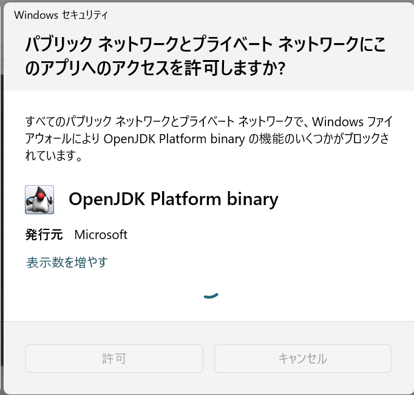
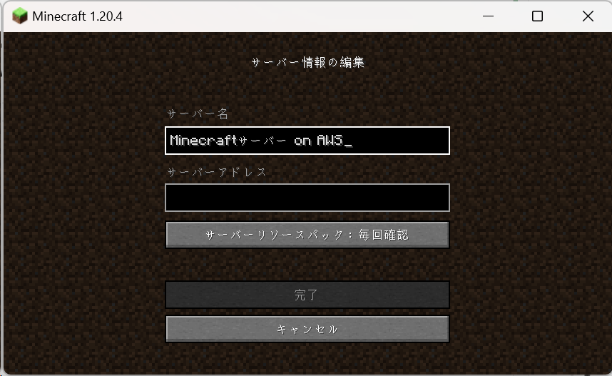
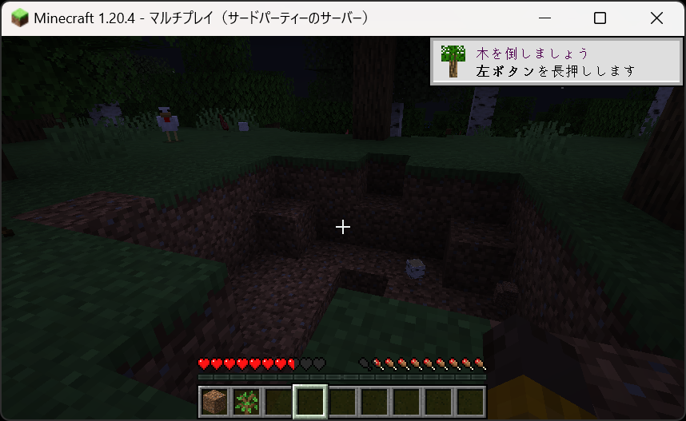

# AWSにマインクラフトサーバーを構築するには

## 前提条件

- Minecraft Java Edition Account
- Microsoft アカウント
- AWS CLI プロファイル
- AWS CDK

```bash
npx cdk --version
2.133.0 (build dcc1e75)
```

## CDKプロジェクトの初期化

プロジェクトを初期化します。

```bash
mkdir mc
cd mc
cdk init -l typescript
```

## スタックを記述する

`lib/userdata.sh`

```bash
#!/bin/bash

# *** INSERT SERVER DOWNLOAD URL BELOW ***
# Do not add any spaces between your link and the "=", otherwise it won't work. EG: MINECRAFTSERVERURL=https://urlexample


# Minecraft 1.20.4.jar download link
MINECRAFTSERVERURL=https://piston-data.mojang.com/v1/objects/8dd1a28015f51b1803213892b50b7b4fc76e594d/server.jar


# Download Java
sudo yum install -y java-17-amazon-corretto-headless
# Install MC Java server in a directory we create
adduser minecraft
mkdir /opt/minecraft/
mkdir /opt/minecraft/server/
cd /opt/minecraft/server

# Download server jar file from Minecraft official website
wget $MINECRAFTSERVERURL

# Generate Minecraft server files and create script
chown -R minecraft:minecraft /opt/minecraft/
java -Xmx1300M -Xms1300M -jar server.jar nogui
sleep 40
sed -i 's/false/true/p' eula.txt
touch start
printf '#!/bin/bash\njava -Xmx1300M -Xms1300M -jar server.jar nogui\n' >> start
chmod +x start
sleep 1
touch stop
printf '#!/bin/bash\nkill -9 $(ps -ef | pgrep -f "java")' >> stop
chmod +x stop
sleep 1

# Create SystemD Script to run Minecraft server jar on reboot
cd /etc/systemd/system/
touch minecraft.service
printf '[Unit]\nDescription=Minecraft Server on start up\nWants=network-online.target\n[Service]\nUser=minecraft\nWorkingDirectory=/opt/minecraft/server\nExecStart=/opt/minecraft/server/start\nStandardInput=null\n[Install]\nWantedBy=multi-user.target' >> minecraft.service
sudo systemctl daemon-reload
sudo systemctl enable minecraft.service
sudo systemctl start minecraft.service

# End script
```

minecraft_server.1.20.4.jar のダウンロード URL は、公式サイトに記載されています。

https://www.minecraft.net/ja-jp/download/server

`lib/mc-stack.ts`

```typescript
import { Stack, StackProps, CfnOutput } from 'aws-cdk-lib';
import * as ec2 from 'aws-cdk-lib/aws-ec2';
import { Construct } from 'constructs';
import { readFileSync } from 'fs';

export class McStack extends Stack {
  constructor(scope: Construct, id: string, props?: StackProps) {
    super(scope, id, props);

    // vpc
    const vpc = new ec2.Vpc(this, 'McVpc', {
      vpcName: 'mc-vpc',
      ipAddresses: ec2.IpAddresses.cidr('172.16.0.0/16'),
      natGateways: 0,
      maxAzs: 1,
      subnetConfiguration: [
        {
          cidrMask: 24,
          name: 'Public',
          subnetType: ec2.SubnetType.PUBLIC
        },
      ],
      // remove all rules from default security group
      // See: https://docs.aws.amazon.com/config/latest/developerguide/vpc-default-security-group-closed.html
      restrictDefaultSecurityGroup: true
    });

    //
    // security group
    //
    const mcEc2Sg = new ec2.SecurityGroup(this, 'McEc2Sg', {
      vpc,
      allowAllOutbound: true,
      description: 'for a minecraft server'
    });
    mcEc2Sg.addIngressRule(ec2.Peer.anyIpv4(), ec2.Port.tcp(22), 'allow ssh from anywhere');
    // See: https://ip-ranges.amazonaws.com/ip-ranges.json
    mcEc2Sg.addIngressRule(ec2.Peer.ipv4('3.112.23.0/29'), ec2.Port.allTraffic(), 'allow ec2 instance connect from ap-northeast-1 ip range');
    mcEc2Sg.addIngressRule(ec2.Peer.anyIpv4(), ec2.Port.tcp(25565), 'allow minecraft connection from anywhere');

    //
    // Minecraft server
    //
    const userDataScript = readFileSync('lib/userdata.sh', 'utf-8');
    const userData = ec2.UserData.custom(userDataScript);
    const mcEc2 = new ec2.Instance(this, 'McEc2', {
      instanceName: 'mc-ec2',
      instanceType: ec2.InstanceType.of(ec2.InstanceClass.T3, ec2.InstanceSize.SMALL),
      machineImage: ec2.MachineImage.latestAmazonLinux2023(),
      vpc,
      vpcSubnets: vpc.selectSubnets({
        subnetType: ec2.SubnetType.PUBLIC,
      }),
      associatePublicIpAddress: true,
      securityGroup: mcEc2Sg,
      blockDevices: [
        {
          deviceName: '/dev/xvda',
          volume: ec2.BlockDeviceVolume.ebs(8, {
            encrypted: true
          }),
        },
      ],
      userData,
      propagateTagsToVolumeOnCreation: true,
    })

    new CfnOutput(this, 'McServerPublicIp', {
      value: mcEc2.instancePublicIp,
    });
  }
}
```

## CDKのデプロイ

その AWS アカウントで初めて CDK を利用する場合は、bootstrap が必要です。

```bash
npx cdk bootstrap --profile <your-profile>
```

デプロイします。

```bash
npx cdk diff --profile <your-profile>
```

### マインクラフトサーバーの開始

EC2 Instance Connect でログインします。

`/opt/minecraft/server` にサーバーファイルが存在することを確認します。

`sudo ./start` でサーバーを開始します。

`Done` が出力されれば、サーバーは開始しています。

`op` コマンドでオペレーターを追加します。

```bash
op <your-name>
```

### マインクラフトにログインする

Windows 用のランチャーをダウンロードし実行すると、ランチャーをインストールできます。

https://www.minecraft.net/ja-jp/download

ランチャーが起動したら、Microsoft アカウントでログインします。

初回利用時は、トラフィックの許可が必要。



https://www.conoha.jp/vps/media/mine-semi/multi-server/#section-05

[サーバーを追加]から EC2 のパブリック IP を[サーバーアドレス]に設定します。





### サーバーを終了する

```bash
npx cdk destroy --profile <your-profile>
```
