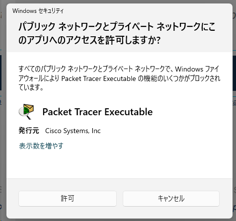

# Packet-Tracerをクイックスタートするには

Cisco Networking Academy にサインインし、インストーラーをダウンロードする。

https://www.netacad.com/portal/resources/packet-tracer

起動時に、必要に応じてトラフィックを許可する。

ログインダイアログが表示されたら、Networking Academy にサインインする。
