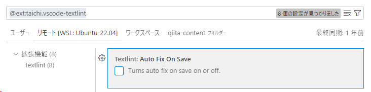

# 日本語に適切なスペースを入れるには

textlint にルールを追加する。

https://github.com/textlint-ja/textlint-rule-preset-ja-spacing

```bash
npm install textlint-rule-preset-ja-spacing --save-dev
```

`.textlintrc.json` を変更する。

```json:.textlintrc.json
{
  "rules": {
    "preset-ja-spacing": {
      "ja-space-between-half-and-full-width": {
        "space": "always"
      }
    }
  }
}
```

`Auto Fix On Save`が無効だと、保存するときに自動で Fix されなかった。



有効にすると、自動で Fix されるようになった。


## 参考

https://dev.classmethod.jp/articles/automating-insertion-of-spaces-between-japanese-and-english-text-in-markdown-editing-with-textlint-in-vscode/
